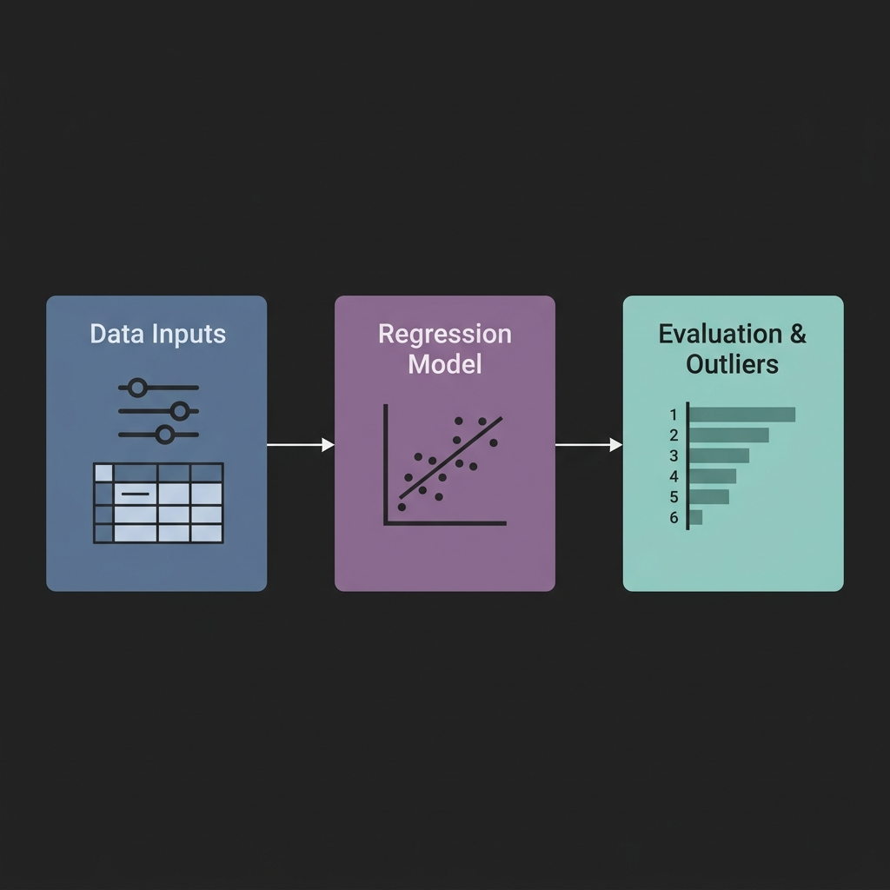

# Linear Regression Practice

本專案是一個線性迴歸分析展示工具，核心目標是用 `Python` 與 `Streamlit` 建立可互動的模型介面，觀察模型預測、殘差分布與異常觀測。

實際案例以台中、彰化空氣品質資料作為延伸情境。

專案使用一個可調參數的迴歸模擬器，用來理解模型、殘差與離群值排序的基礎流程；

主要案例則放在中部空氣品質指標 (Air Quality Index, AQI) / PM2.5 等數值資料，讓分析結果可以對應到空污觀測、戶外活動安排與營運風險提醒等實際需求。

🔗 [**Live Demo**](https://linear-regression-practice-dec591nyc.streamlit.app/)

---

## 專案 Infography

| 面向 | 內容 |
| --- | --- |
| 專案定位 | 線性迴歸實作、模型指標解讀與異常觀測偵測 |
| 基礎模組 | 以 `y = ax + b + noise` 產生資料，訓練線性迴歸模型並找出前 10 個殘差離群點 |
| 實際案例 | 以台中、彰化空氣品質指標 (AQI) / PM2.5 數值資料進行污染指標預測與異常觀測排序 |
| 資料來源 | 優先使用環境部 `AQX_P_488` 歷史 AQI；Kaggle Taiwan AQI 作為歷史參考 |
| 介面功能 | 中英文切換、深淺色主題、資料下載、互動圖表 |
| 核心技術 | Streamlit、NumPy、Pandas、scikit-learn、Plotly |
| 展示重點 | 互動參數、迴歸線、殘差、Top 10 outliers、資料來源替代性評估 |

### 專案架構與流程 (Project Infography)




---

## 核心功能

- **模擬線性迴歸實驗室**：透過側邊欄調整 `n`、`a`、`b`、`var` 與 random seed，重新產生 app 內部模擬數值資料；雜訊變異數與隨機種子同時提供常見區段下拉與手動輸入。
- **線性模型擬合**：迴歸模擬器與 AQI 案例皆可選擇 OLS、Ridge、Lasso、ElasticNet；
- **離群值偵測**：計算每筆資料的 residual 與 absolute residual，列出距離迴歸線最遠的前 10 筆觀測。
- **互動視覺化**：圖表同時呈現生成資料、真實線、迴歸線與 Top 10 outliers。
- **中部空氣品質指標 (AQI) 案例**：目前使用 `data/central_taiwan_aqi_sample.csv`，共 82,034 筆台中、彰化、南投空氣品質資料，支援目標、特徵、地區與線性模型切換。
- **雙語與主題切換**：支援繁體中文 / English，以及 light / dark theme。
- **CRISP-DM 實踐說明**：以 Business Understanding、Data Understanding、Data Preparation、Modeling、Evaluation、Deployment 六階段說明分析流程。
- **資料與報告下載**：使用者可下載 AQI 頁目前實際使用的 CSV；CRISP-DM markdown 報告會依目前中英文模式輸出。
- **Data Source**：說明目前使用資料、Lab 合成資料邊界、Kaggle 歷史參考與環境部官方來源。

---

## Data Source

AQI 分頁目前使用 `data/central_taiwan_aqi_sample.csv`，共有 82,034 筆，範圍包含 Taichung City、Changhua County 與 Nantou County。這份資料用來支援實際空氣品質案例的回歸建模、殘差排序與異常觀測判讀。

Lab 頁不使用老師課堂資料、Kaggle、環境部或任何 CSV。Lab 的資料由 `app.py` 依照 `y = a*x + b + noise` 在記憶體即時產生；左側的樣本數、斜率、截距、雜訊變異數與隨機種子就是資料生成條件。

本專案保留 Kaggle 的 [Taiwan Air Quality Index Data 2016~2024](https://www.kaggle.com/datasets/taweilo/taiwan-air-quality-data-20162024) 作為歷史資料參考。

正式資料以環境部官方歷史資料 [AQX_P_488](https://data.moenv.gov.tw/en/dataset/detail/aqx_p_488) 為優先；即時每小時資料可參考 [AQX_P_432](https://data.moenv.gov.tw/dataset/detail/aqx_p_432)。欄位包含測站名稱、縣市、AQI、SO2、CO、O3、PM10、PM2.5、NO2、風速、風向、發布時間與經緯度。


---

## 本機執行

建立虛擬環境後安裝套件：

```bash
pip install -r requirements.txt
```

啟動 Streamlit：

```bash
streamlit run app.py
```

啟動後在瀏覽器開啟：

```text
http://localhost:8501
```

---

## 目錄結構

```text
Linear-Regression-Practice/
├── app.py
├── requirements.txt
├── README.md
└── data/
    ├── central_taiwan_aqi_sample.csv
    └── CentraArea_Data.csv
```

---

## 技術重點

- **Streamlit**：建立互動式資料分析頁面與 tab 分頁。
- **Pandas**：讀取 CSV、整理欄位、篩選台中、彰化與南投資料。
- **NumPy**：產生模擬資料、計算殘差與 least-squares fallback。
- **scikit-learn**：建立線性迴歸模型並取得模型係數。
- **Plotly**：呈現互動散佈圖、迴歸線與模型預測結果。

---

## 開發收穫

這個專案主要用來確認線性迴歸分析能否完整處理：

- 模擬資料生成與參數控制
- 線性模型訓練與模型指標解讀
- 殘差排序與離群值偵測
- 實際資料來源與替代資料來源說明
- 將課堂要求延伸到中部空氣品質案例

專案保留基礎公式與互動參數，並補上可以對應公共治理、戶外活動安排與營運風險提醒的實務情境。
