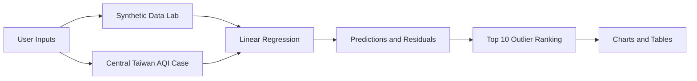

# 中彰空氣品質迴歸分析

本專案是一個以台中、彰化空氣品質為情境的資料分析展示工具，核心目標是用 `Python` 與 `Streamlit` 建立可互動的迴歸分析介面，觀察模型預測、殘差分布與異常觀測。

專案保留一個可調參數的迴歸模擬器，用來確認模型、殘差與離群值排序的基礎流程；主要案例則放在中彰 AQI / PM2.5 等數值資料，讓分析結果可以對應到空污觀測、戶外活動安排與營運風險提醒等實際需求。

Live Demo：部署後補上 Streamlit Community Cloud 連結。

---

## 專案 Infography

| 面向 | 內容 |
| --- | --- |
| 專案定位 | 中彰空氣品質迴歸分析與異常觀測偵測 |
| 基礎模組 | 以 `y = ax + b + noise` 產生資料，訓練線性迴歸模型並找出前 10 個殘差離群點 |
| 實際案例 | 以台中、彰化 AQI / PM2.5 數值資料進行污染指標預測與異常觀測排序 |
| 資料來源 | Kaggle Taiwan AQI 整理資料；正式替代來源為環境部 `AQX_P_432` API |
| 介面功能 | 中英文切換、深淺色主題、進階 CSV 匯入、互動圖表 |
| 核心技術 | Streamlit、NumPy、Pandas、scikit-learn、Plotly |
| 展示重點 | 互動參數、迴歸線、殘差、Top 10 outliers、資料來源替代性評估 |



Infography 視覺圖可另交由 Gemini 產出；本 README 先保留文字版資訊架構。

---

## 核心功能

- **模擬線性迴歸實驗室**：透過側邊欄調整 `n`、`a`、`b`、`var` 與 random seed，重新產生數值資料。
- **線性模型擬合**：優先使用 `scikit-learn LinearRegression`，若環境缺少套件則以 NumPy least-squares 作為 fallback。
- **離群值偵測**：計算每筆資料的 residual 與 absolute residual，列出距離迴歸線最遠的前 10 筆觀測。
- **互動視覺化**：圖表同時呈現生成資料、真實線、迴歸線與 Top 10 outliers。
- **中彰 AQI 案例**：預設使用內建中彰 sample；進階模式可上傳 Kaggle 或環境部格式 CSV，篩選台中市、彰化縣測站資料進行 AQI 預測。
- **雙語與主題切換**：支援繁體中文 / English，以及 light / dark theme。
- **資料來源評估**：說明 Kaggle 整理資料與環境部官方 API 的取捨，避免實際案例偏離作業要求。

---

## 資料來源評估

本專案建議以 Kaggle 的 [Taiwan Air Quality Index Data 2016~2024](https://www.kaggle.com/datasets/taweilo/taiwan-air-quality-data-20162024) 作為課堂展示資料。它已整理成適合機器學習練習的 AQI、污染物與時間資料，適合做 regression、multivariate analysis 與 outlier detection。

正式應用時，可改用環境部官方的 [空氣品質指標 AQI 開放資料](https://data.moenv.gov.tw/dataset/detail/aqx_p_432)。該資料每小時提供各測站 AQI 與污染物欄位，包含測站名稱、縣市、AQI、SO2、CO、O3、PM10、PM2.5、NO2、風速、風向、發布時間與經緯度。

本專案將模擬資料與 AQI 案例分開呈現。模擬資料用來保留基礎迴歸、參數控制與殘差排序的技術要求；AQI 案例則用來補上真實資料脈絡，避免專案只停留在抽象公式。

---

## 本機執行

建立虛擬環境後安裝套件：

```bash
pip install -r requirements.txt
```

啟動 Streamlit：

```bash
streamlit run app.py
```

啟動後在瀏覽器開啟：

```text
http://localhost:8501
```

---

## 目錄結構

```text
central-taiwan-aqi-regression/
├── app.py
├── requirements.txt
├── README.md
├── data/
│   └── central_taiwan_aqi_sample.csv
└── docs/
    └── data_source_evaluation.md
```

`data/central_taiwan_aqi_sample.csv` 用於本機展示欄位格式與互動流程。正式作業展示時，可改以上傳 Kaggle AQI CSV 或環境部 API 匯出的 CSV。

---

## 技術重點

- **Streamlit**：建立互動式資料分析頁面與 tab 分頁。
- **Pandas**：讀取 CSV、整理欄位、篩選台中與彰化資料。
- **NumPy**：產生模擬資料、計算殘差與 least-squares fallback。
- **scikit-learn**：建立線性迴歸模型並取得模型係數。
- **Plotly**：呈現互動散佈圖、迴歸線與模型預測結果。

---

## 開發收穫

這個專案主要用來確認線性迴歸分析能否完整處理：

- 模擬資料生成與參數控制
- 線性模型訓練與模型指標解讀
- 殘差排序與離群值偵測
- 實際資料來源與替代資料來源評估
- 將課堂要求延伸到台中、彰化空氣品質案例

專案保留基礎公式與互動參數，並補上可以對應公共治理、戶外活動安排與營運風險提醒的實務情境。
